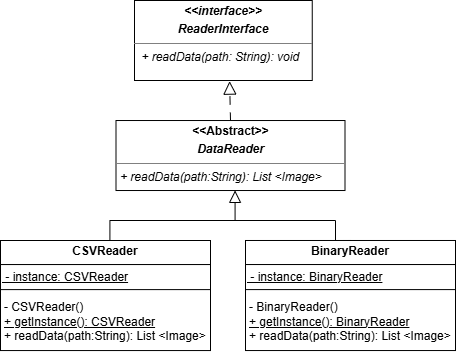
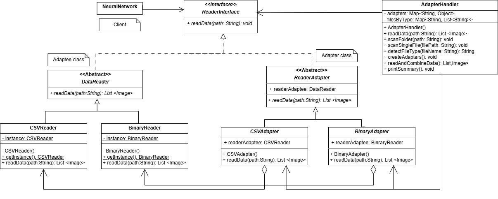
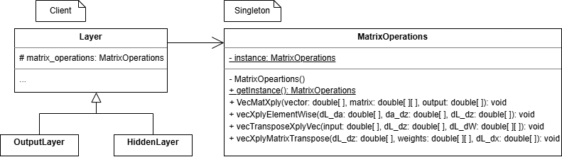

## Adapter, AdapterFactory and Singleton pattern Implementation

**Reference Type (The Variable)**: This is just a "handle" or a "remote control." It defines what methods you are allowed to call.

**Object Type (The Instance)**: This is the actual machinery running behind the scenes. It defines what the code actually does.

We can point a variable of Interface Type to an object of Class Type, as long as that Class implements the Interface.

The nn.reader variable is a reference (a pointer).
That pointer points to the ReaderAdapter object in memory.
The ReaderAdapter object has a pointer to the JSONReader object.

**1 Adapter per file type**

with a Singleton DataReader, you only need one ReaderAdapter to wrap it. You don't need a factory to create new adapters for every file load. You can just reuse the same adapter instance.

Example: "The Singleton Adapter" (or rather, the Reusable Adapter)

**Used convention:**

- classes: CamelCase (NeuralNetwork, ReaderAdapter)
- folders: camelCase with first letter lowercase (dataReaders, neuralNetwork, layers)
- methods: camelCase with first letter lowercase (readData, train)

**AdapterHandler.java:** 

- Singleton reuse - multiple CSV files use same CSVReader.getInstance()
- Lazy adapter creation - only creates adapters for file types found
- Seamless combining - NeuralNetwork gets one clean list, doesn't know about files
- Stateful handler - stores adapters and file lists as instance attributes
- Folder scanning - detects heterogeneous files (CSV + Binary in same folder)

**Binary dataset**

 Obtained from: https://github.com/fgnt/mnist

## AdapterFactory pattern on ReaderAdapter

Management of individual adapters is handled by the AdapterFactory, which creates and provides access to the appropriate adapter based on the file type. This allows for a clean separation of concerns and promotes code reusability.

## Singleton pattern on MatrixOperations class

**Changes made:**
Made public static methods of MatrixOperations class public only, and loaded MatrixOperation object in Layer class as a protected attribute for child access.

## Applied UML Diagrams

**Singleton(DataReader children)**

**Adapter(ReaderAdapter children) and AdapterFactory(ReaderAdapter)**

**Singleton (Mathematical Operations)**

